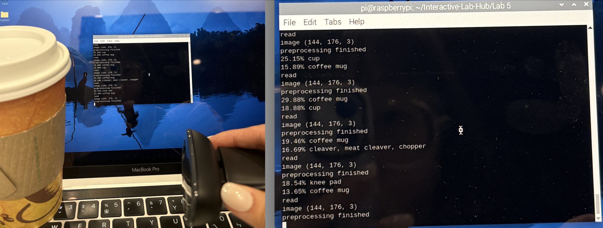
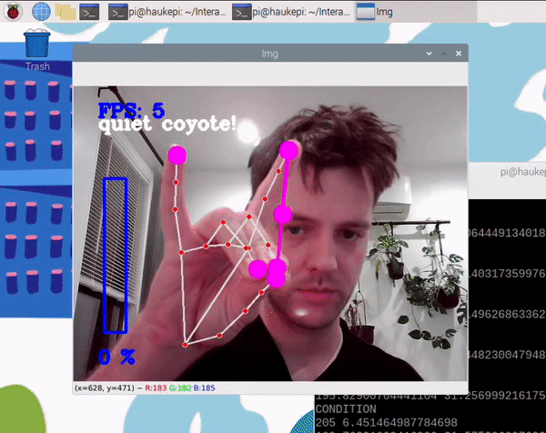
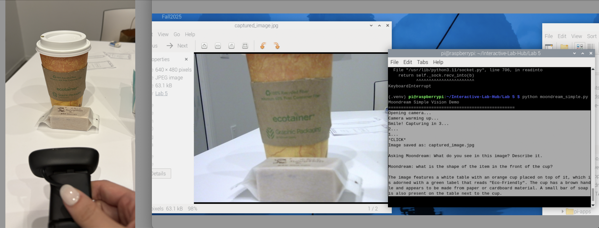
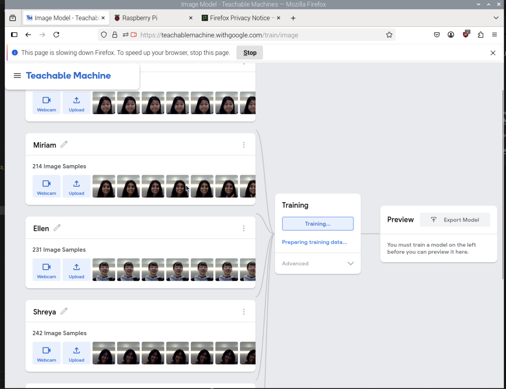
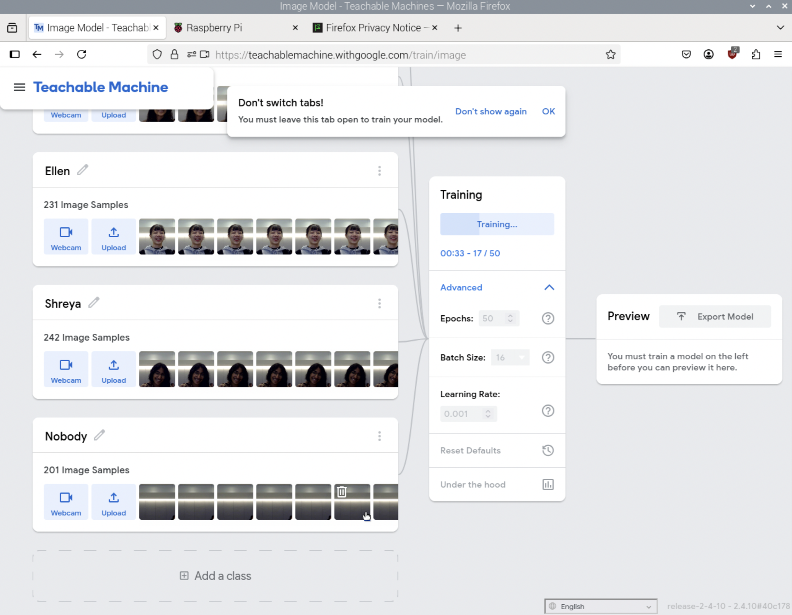
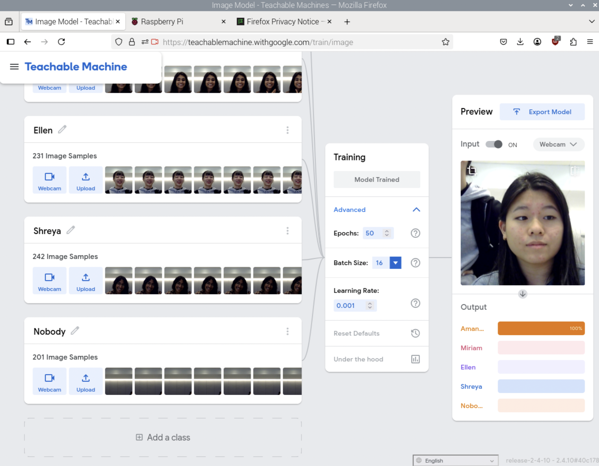
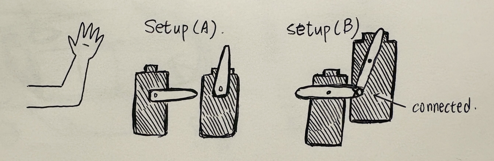
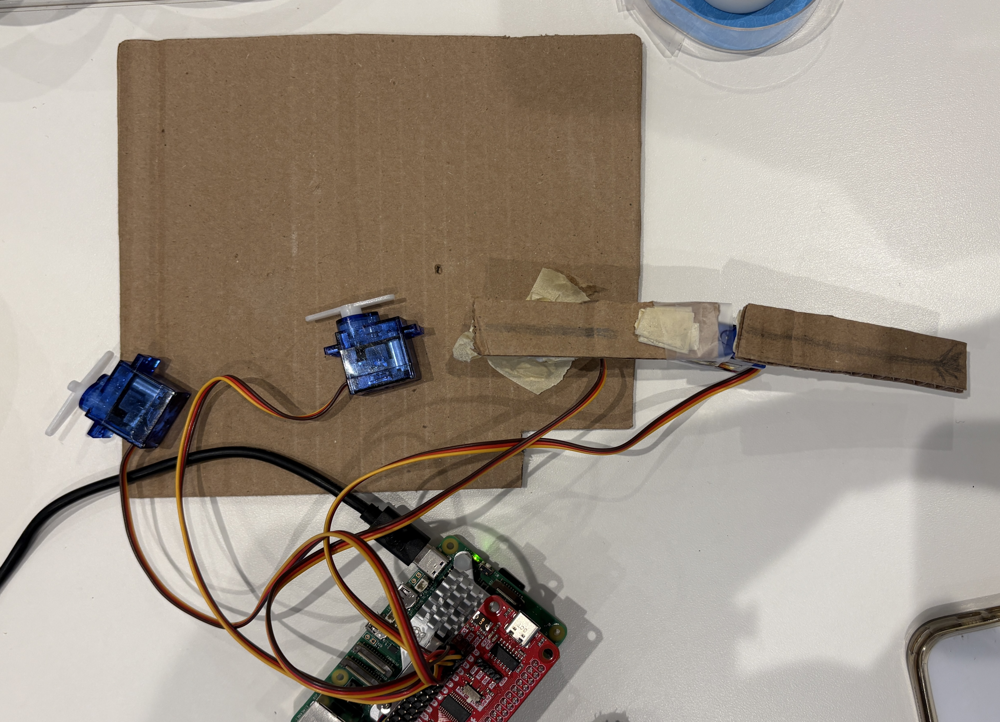
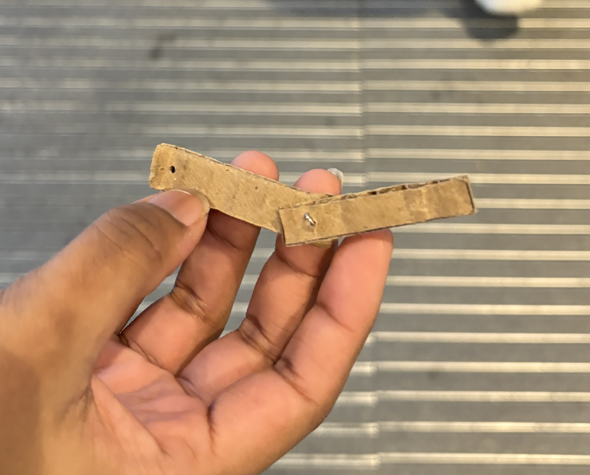
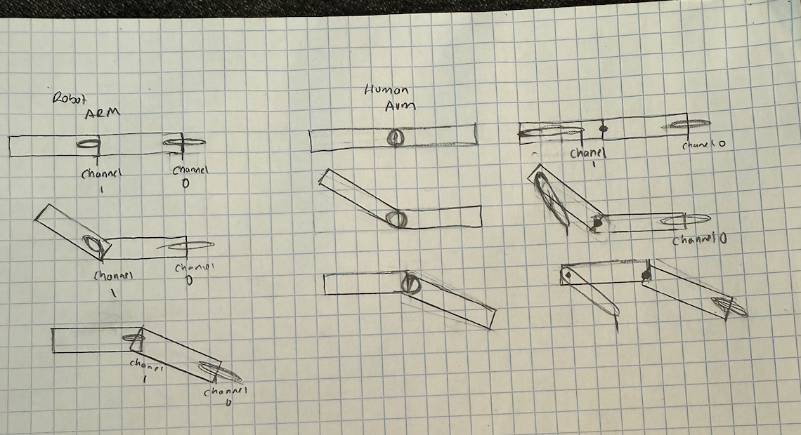

# Observant Systems

**COLLABORATORS:**
[Amanda Lu](https://github.com/amandazlu/Interactive-Lab-Hub/edit/Fall2025/Lab%205/README.md), [Miriam Alex](https://github.com/miriam-alex/Interactive-Lab-Hub/tree/Fall2025/Lab%205), [Ying Yu Chen](https://github.com/chenyingyu-main/Interactive-Lab-Hub/tree/Fall2025/Lab%205)  

Main Repository is Shreya Kethi Reddy ^

For lab this week, we focus on creating interactive systems that can detect and respond to events or stimuli in the environment of the Pi, like the Boat Detector we mentioned in lecture. 
Your **observant device** could, for example, count items, find objects, recognize an event or continuously monitor a room.

This lab will help you think through the design of observant systems, particularly corner cases that the algorithms need to be aware of.

## Prep

1. ✅ Install VNC on your laptop if you have not yet done so. This lab will actually require you to run script on your Pi through VNC so that you can see the video stream. Please refer to the [prep for Lab 2](https://github.com/FAR-Lab/Interactive-Lab-Hub/blob/-/Lab%202/prep.md#using-vnc-to-see-your-pi-desktop).
2. ✅ Install the dependencies as described in the [prep document](prep.md). 
3.  Read about [OpenCV](https://opencv.org/about/),[Pytorch](https://pytorch.org/), [MediaPipe](https://mediapipe.dev/), and [TeachableMachines](https://teachablemachine.withgoogle.com/).
4.  Read Belloti, et al.'s [Making Sense of Sensing Systems: Five Questions for Designers and Researchers](https://www.cc.gatech.edu/~keith/pubs/chi2002-sensing.pdf).

### For the lab, you will need:
1. Pull the new Github Repo
1. Raspberry Pi
1. Webcam 

### Deliverables for this lab are:
1. Show pictures, videos of the "sense-making" algorithms you tried.
1. Show a video of how you embed one of these algorithms into your observant system.
1. Test, characterize your interactive device. Show faults in the detection and how the system handled it.

## Overview
Building upon the paper-airplane metaphor (we're understanding the material of machine learning for design), here are the four sections of the lab activity:

A) [Play](#part-a)

B) [Fold](#part-b)

C) [Flight test](#part-c)

D) [Reflect](#part-d)

---

### Part A
### Play with different sense-making algorithms.

#### Pytorch for object recognition

<details>
For this first demo, you will be using PyTorch and running a MobileNet v2 classification model in real time (30 fps+) on the CPU. We will be following steps adapted from [this tutorial](https://pytorch.org/tutorials/intermediate/realtime_rpi.html).


To get started, install dependencies into a virtual environment for this exercise as described in [prep.md](prep.md).

Make sure your webcam is connected.

You can check the installation by running:

```
python -c "import torch; print(torch.__version__)"
```

If everything is ok, you should be able to start doing object recognition. For this default example, we use [MobileNet_v2](https://arxiv.org/abs/1801.04381). This model is able to perform object recognition for 1000 object classes (check [classes.json](classes.json) to see which ones.

Start detection by running  

```
python infer.py
```

The first 2 inferences will be slower. Now, you can try placing several objects in front of the camera.

Read the `infer.py` script and become familiar with the code. You can change the video resolution and frames per second (FPS). You may also use the weights of the larger pre-trained mobilenet_v3_large model, as described [here](https://pytorch.org/tutorials/intermediate/realtime_rpi.html#model-choices).

</details>



> We tested our model on a coffee cup from Cornell Café. As shown in the terminal output, it detected objects like cups and coffee mugs. Yet, the model didn’t perform very well — it also produced several completely unrelated predictions.

#### More classes

<details>

[PyTorch supports transfer learning](https://pytorch.org/tutorials/beginner/transfer_learning_tutorial.html), so you can fine‑tune and transfer learn models to recognize your own objects. It requires extra steps, so we won't cover it here.

For more details on transfer learning and deployment to embedded devices, see Deep Learning on Embedded Systems: A Hands‑On Approach Using Jetson Nano and Raspberry Pi (Tariq M. Arif). [Chapter 10](https://onlinelibrary.wiley.com/doi/10.1002/9781394269297.ch10) covers transfer learning for object detection on desktop, and [Chapter 15](https://onlinelibrary.wiley.com/doi/10.1002/9781394269297.ch15) describes moving models to the Pi using ONNX.

</details>

---

### Machine Vision With Other Tools
The following sections describe tools ([MediaPipe](#mediapipe) and [Teachable Machines](#teachable-machines)).

#### MediaPipe

<details>

A established open source and efficient method of extracting information from video streams comes out of Google's [MediaPipe](https://mediapipe.dev/), which offers state of the art face, face mesh, hand pose, and body pose detection.



To get started, install dependencies into a virtual environment for this exercise as described in [prep.md](prep.md):

Each of the installs will take a while, please be patient. After successfully installing mediapipe, connect your webcam to your Pi and use **VNC to access to your Pi**, open the terminal, and go to Lab 5 folder and run the hand pose detection script we provide:
(***it will not work if you use ssh from your laptop***)


```
(venv-ml) pi@ixe00:~ $ cd Interactive-Lab-Hub/Lab\ 5
(venv-ml) pi@ixe00:~ Interactive-Lab-Hub/Lab 5 $ python hand_pose.py
```

Try the two main features of this script: 1) pinching for percentage control, and 2) "[Quiet Coyote](https://www.youtube.com/watch?v=qsKlNVpY7zg)" for instant percentage setting. Notice how this example uses hardcoded positions and relates those positions with a desired set of events, in `hand_pose.py`. 

Consider how you might use this position based approach to create an interaction, and write how you might use it on either face, hand or body pose tracking.

(You might also consider how this notion of percentage control with hand tracking might be used in some of the physical UI you may have experimented with in the last lab, for instance in controlling a servo or rotary encoder.)

</details>

> We tried running the script (see the demo video below). It turned out to be quite accurate; the model was able to identify the points on the hand even when it rotated.

* [Testing Video from Amanda](https://youtu.be/EOdf198vDdk)
* [Another Testing Video](https://youtube.com/shorts/Flvvdf97vMM)


#### Moondream Vision-Language Model

<details>

[Moondream](https://www.ollama.com/library/moondream) is a lightweight vision-language model that can understand and answer questions about images. Unlike the classification models above, Moondream can describe images in natural language and answer specific questions about what it sees.

To use Moondream, first make sure Ollama is running and pull the model:
```bash
ollama pull moondream
```

Then run the simple demo script:
```bash
python moondream_simple.py
```

This will capture an image from your webcam and let you ask questions about it in natural language. Note that vision-language models are slower than classification models (responses may take up to minutes on a Raspberry Pi). There are newer models like [LFM2-VL](https://huggingface.co/LiquidAI/LFM2-VL-450M-GGUF), but many are very recent and not yet optimized for embedded devices.

**Design consideration**: Think about how slower response times change your interaction design. What kinds of observant systems benefit from thoughtful, delayed responses rather than real-time classification? Consider systems that monitor over longer time periods or provide periodic summaries rather than instant feedback.

</details>



> The model responds quickly, its answers are sometimes off-topic (see the image above).


#### Teachable Machines

<details>

Google's [TeachableMachines](https://teachablemachine.withgoogle.com/train) is very useful for prototyping with the capabilities of machine learning. We are using [a python package](https://github.com/MeqdadDev/teachable-machine-lite) with tensorflow lite to simplify the deployment process.


To get started, install dependencies into a virtual environment for this exercise as described in [prep.md](prep.md):

After installation, connect your webcam to your Pi and use **VNC to access to your Pi**, open the terminal, and go to Lab 5 folder and run the example script:
(***it will not work if you use ssh from your laptop***)


```
(venv-tml) pi@ixe00:~ Interactive-Lab-Hub/Lab 5 $ python tml_example.py
```


Next train your own model. Visit [TeachableMachines](https://teachablemachine.withgoogle.com/train), select Image Project and Standard model. The raspberry pi 4 is capable to run not just the low resource models. Second, use the webcam on your computer to train a model. *Note: It might be advisable to use the pi webcam in a similar setting you want to deploy it to improve performance.*  For each class try to have over 150 samples, and consider adding a background or default class where you have nothing in view so the model is trained to know that this is the background. Then create classes based on what you want the model to classify. Lastly, preview and iterate. Finally export your model as a 'Tensorflow lite' model. You will find an '.tflite' file and a 'labels.txt' file. Upload these to your pi (through one of the many ways such as [scp](https://www.raspberrypi.com/documentation/computers/remote-access.html#using-secure-copy), sftp, [vnc](https://help.realvnc.com/hc/en-us/articles/360002249917-VNC-Connect-and-Raspberry-Pi#transferring-files-to-and-from-your-raspberry-pi-0-6), or a connected visual studio code remote explorer).


Include screenshots of your use of Teachable Machines, and write how you might use this to create your own classifier. Include what different affordances this method brings, compared to the OpenCV or MediaPipe options.

</details>


<table>
<tr>
<td width="30%"></td>
<td width="30%"></td>
<td width="30%"></td>
</tr>
</table>

> In this experiment, we collected facial images of our four team members (multi-angle) (shown on the left). We then trained a face recognition model using these images (middle) and tested whether the model could correctly identify each person (right).
>
> Interestingly, we found that wearing glasses didn’t significantly affect recognition accuracy (the model was still able to recognize Shreya correctly in both cases anyway :).

* [Testing Video from Amanda](https://youtu.be/BHHur6Tpn5U)

#### (Optional) Legacy audio and computer vision observation approaches

<details>

In an earlier version of this class students experimented with observing through audio cues. Find the material here:
[Audio_optional/audio.md](Audio_optional/audio.md). 
Teachable machines provides an audio classifier too. If you want to use audio classification this is our suggested method. 

In an earlier version of this class students experimented with foundational computer vision techniques such as face and flow detection. Techniques like these can be sufficient, more performant, and allow non discrete classification. Find the material here:
[CV_optional/cv.md](CV_optional/cv.md).

</details>

### Part B
### Construct a simple interaction.

* Pick one of the models you have tried, and experiment with prototyping an interaction.
* This can be as simple as the boat detector shown in lecture.
* Try out different interaction outputs and inputs.

**\*\*\*Describe and detail the interaction, as well as your experimentation here.\*\*\***

**1️⃣ Idea and Interaction Intro:** 
>We constructed a simple interaction using Raspberry Pi and **MediaPipe** to detect upper-body poses and map them to servo motor movements. The idea is to let a small robot (servo) **mimic the user’s arm motions in real-time**.
>
> We chose this interaction because it has the potential to be extended into many different applications. For example, it could be used for gesture control in games, full-body tracking for a small humanoid robot, or interactive experiences like mirroring challenges and “Just Dance”-style games.
>
> But still, in this lab, we are testing our idea :) We will cover arm detection and make the servo move.

**2️⃣ Model / Mechanism:**
> For part 1, we tried mapping one arm first to ensure the servo response for experiment.
> 
> The model returns the **coordinates of the arm joints**, which we then use to calculate the angles geometrically and control the servo’s rotation accordingly.

**3️⃣ Interaction Input & Output:**
> * **Input:** Web Camera (Camera feed capturing user’s upper-body movement. (via MediaPipe Pose))
> * **Output:** Servo motors (Motors move to mimic user’s arm gesture.)
>
> **Trying with different output:** We plan to keep the same servo motor but change the position of its attachment (servo horn). In setup (A), the servo rotates around its center, while in setup (B), it is mounted at the base and drives a link from one end of the attachment. 
>
> 
> 
> We will observe which setup is easier to implement and which one makes more sense.
>
>We ended up choosing **setup (C)**, where the servo is connected to the tip of one fan blade.
The figure below shows an example of this setup (left), and the right image shows our initial arm prototype, which was too fragile and eventually broke.
>
><div style="display:flex; gap:2%; align-items:flex-start;">
>  
>  
></div>
>
> **Setup (C) design:**
> 


**4️⃣ Experiment and Findings:**
> 1. When running MediaPipe Pose, we found that it **starts detection from the face** — if no face is detected, the entire body skeleton cannot be identified.
> 2. Once the full body is clearly visible, covering the face still allows the skeleton to be detected in some cases (though it may occasionally disappear).
> 3. When the face is visible, every keypoint returns a value — **even for body parts that are not actually visible to the camera** (e.g., wrists outside the frame). This creates a difficult-to-handle error, since the model still outputs coordinates for invisible joints.

### Part C
### Test the interaction prototype

Now flight test your interactive prototype and **note down your observations**:
For example:
1. When does it what it is supposed to do?
1. When does it fail?
1. When it fails, why does it fail?
1. Based on the behavior you have seen, what other scenarios could cause problems?

[Shreya Initial Testing Video](https://drive.google.com/file/d/1xe-Ycy_xJDwAkDrmGmYguij1B5reEs9V/view?usp=sharing)

Our observations:
> - When the user moves their arm slowly and steadily, the prototype seems to move along well with user's arm, however when the user speeds thier motions, the prototype has a harder time reflecting that movement. 
> - The system works best when both arms are in frame and to do so, the user must be pretty far away from the camera and the prototype
> - The prototype is a littly bulky and often the tape is not enough to keep the the components together. Often the second servo will come off the upperarm due to the tape not being strong enough
> - Due to the servo's range of motion, a user has a limited range (from diagonally down to diagonally up for the upper arm and from straight to bent for the lower arm)


**\*\*\*Think about someone using the system. Describe how you think this will work.\*\*\***
1. Are they aware of the uncertainties in the system?
> At frst, users are likely not aware of the uncertainties of the system, such as it not working properly if their face or body parts are out of frame. However, since they can see the video and how their arm is being detected, they can quickly learn how to improve performance of the system by moving around until the model moves smoothly. 
1. How bad would they be impacted by a miss classification)
> A miss classification wouldn't be too terrible since it would only impact the model in the moment. The overall action would still show up fairly well. As long as there aren't too many miss classifications, the user would not be too affected. 
1. How could change your interactive system to address this?
> To improve the issues with uncertainties, we could try using a different pose recognition tool that doesn't require as much of the body to be in frame. Alternatively, when setting up the environment for the user, we could make a marker for where they need to stand so that the camera is able to capture their entire body without any potential for them going out of frame.
1. Are there optimizations you can try to do on your sense-making algorithm.
> A potential optimization we could try is to use a heavier version of MediaPipe to try and get more accuracy. However, it does not run as smoothly on our Raspberry Pi and has more delay in the video, so more fine tuning is required.

### Part D
### Characterize your own Observant system

Now that you have experimented with one or more of these sense-making systems **characterize their behavior**.
During the lecture, we mentioned questions to help characterize a material:
* What can you use X for?
> Our system can be used for a variety of applications, such as modeling movements for a performance or gameplay, performing actions remotely, or as an interactive artwork. These applications are explored further in part 2.
* What is a good environment for X?
> A good environment is one where there is plenty of space for the user to stand and have their whole body in frame of the camera. Good lighting is also important.
* What is a bad environment for X?
> A bad environment is tight spaces, since the pose detection does not function well if it cannot see most of a users' body. Additionally if there is no light, then the sensor also will not work.
* When will X break?
> X will break in bad environments as described above
* When it breaks how will X break?
> When it breaks, our model will perform random movements as the detected poses are misclassified, or it will simply stop moving. 
* What are other properties/behaviors of X?
* How does X feel?
> It feels pretty cool to watch the model arm follow your real-time movements, sort of mesmerizing. 

**\*\*\*Include a short video demonstrating the answers to these questions.\*\*\***

### Part 2.

Following exploration and reflection from Part 1, finish building your interactive system, and demonstrate it in use with a video.

Our code is located in pose.py in this repo
> We implemented our code using the pose_landmarker_lite model as we found this to work best for our use case. 

**\*\*\*Include a short video demonstrating the finished result.\*\*\***
[Finished Result](https://drive.google.com/file/d/1o0Ycdml96MYCBr1kI-ZU8dp1WC1mBWdv/view?usp=sharing)

Feedback
> The prototype seems to shake a lot when moving and it is a little jarring to see, it would be great if there was a way to smooth out the motion 
> One way this can be used is in an art installiation using the same priciples to create cool shadow art
> It is difficult to see yourself since you have to stand a little far away from the camera
> There are sometimes some hallucinations where the arms move without the user moving

Reflections:
> A couple ways that we could expand on this is to add motion to the legs and head, we wanted to add legs as well, but we ended up lacking servos to do so!
> We wanted to also have the user be able to add little costumes to the figure so that there can be customization of the shadow figures and how it looks
> To address the concerns about the hallucinations, and smoothing, we would take another look at our code to try and smooth the motion of the arms and look at the updating of the position of the arm
> To address concerns about the visual being too small, we were thinking we could plug the pi into a larger montior instead or move the camera so that instead of resting on the laptop to rest upon a different structure much further back
